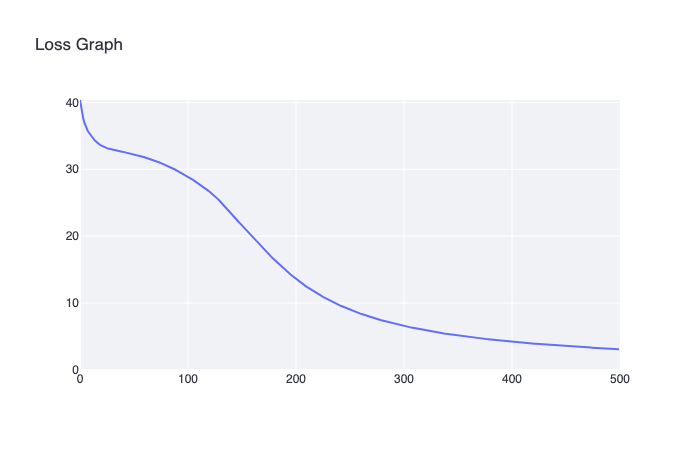
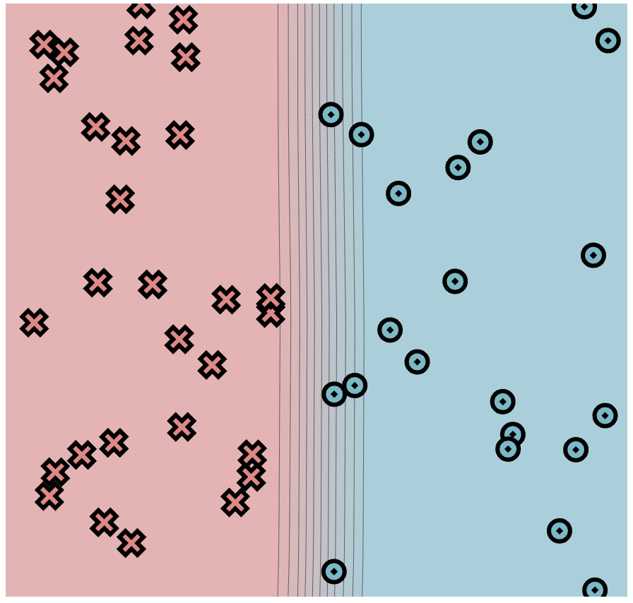

## Task 1.5

For simple config

```
    PTS = 50
    DATASET = minitorch.datasets["Simple"](PTS)
    HIDDEN = 10
    RATE = 0.5
```

we have such training data:




By the way, `HIDDEN=2` model does not train.

For xor dataset I chose `hidden_size=16` and 1k epochs. Results:


